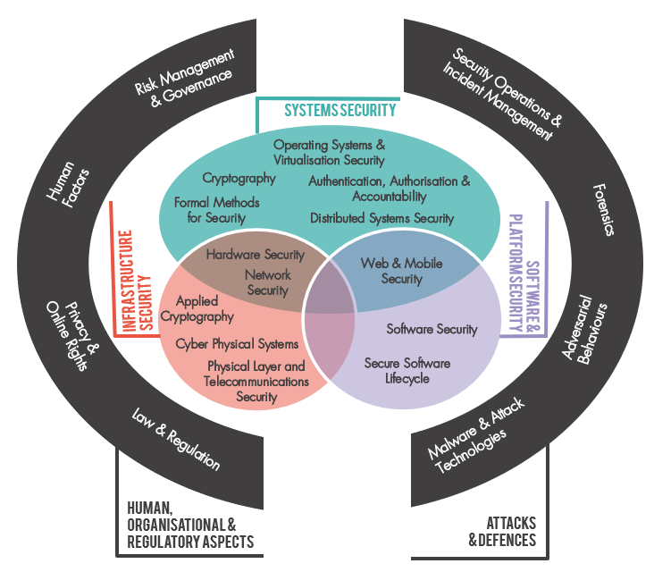

```{r setup}

source("../scripts/setup.R")

responses <- read.csv("../data/raw/cyber_expertise_diversity_survey_responses.csv") |> 
  mutate(id = row_number(), .before = 1)

scenarios <- read.csv("../data/raw/cyber_expertise_diversity_survey_scenarios.csv") |> 
  mutate(id = row_number(), .before = 1)

comb_personal <- read.csv("../data/processed/comb_personal.csv")
comb_scenario <- read.csv("../data/processed/comb_scenario.csv")

alignment_personal <- read.csv("../data/processed/alignment_personal.csv")
alignment_personal_long <- read.csv("../data/processed/alignment_personal_long.csv")

alignment_scenarios <- read.csv("../data/processed/alignment_scenarios.csv")
alignment_scenarios_long <- read.csv("../data/processed/alignment_scenarios_long.csv")
```

## Thinking through classifications

'To classify is human', wrote Bowker and Star in their classic study of classification systems [@bowker1999sorting]. Standardisation smoothes out frictions: if everyone is using the same gauge of wire, the same protocols for communication, the same terminology to refer to the same thing, then the conditions are in place for collaboration and integration, and for a low risk of unforeseen complications. A classification system, can be defined, according to Bowker and Star, as 'a set of boxes (metaphorical or literal) into which things can be put to then do some kind of work' [@bowker1999sorting]. Devising a classification of cyber security expertise has been one of the earliest projects for the cyber security profession. The Cybok project did this in the UK, a large mapping exercise that ingested a wide body of data, and input from practitioners, policymakers and academics, to generate a system of 19 'Knowledge Areas', published in 2019, rising to 21 in the 2021 revision.



CyBOK enables a great deal of work to happen that would otherwise be very difficult. It can help the communication and assessment of cyber security degree programmes and research profiles. It provides a common terminology for making comparisons and building up composite profiles. All of these steps towards standardisation have been part of the emergence of the profession as a distinct problem space, set of professional capabilities, norms and identities.

The UKCSC created its own classification system of 15 specialisms. Where CyBOK focuses on 'knowledge areas', the CSC specialisms are intended to map onto categories of job role. Each knowledge area may be relevant to many specialisms, and each specialism may require many knowledge areas. As part of its cyber careers framework, the CSC provided a mapping of CyBOK to the specialisms, using four levels of relevance ('core', 'related', 'wider' and non-relevant) . Three knowledge areas are not 'core' for any specialisms: Human Factors, Operating Systems and Virtualisation Security, and Physical Layer and Telecoms Security. Formal Methods and Applied Cryptography are not included due to being added in the 2021 CyBOK 1.1 update. Security Operations & Incident Management is the most well represented knowledge area, core to 6 specialisms, followed by Law & Regulation, core to 4 specialisms.

All classification systems have downsides. One downside is the propensity to create path dependencies. Classification systems are a kind of knowledge infrastructure, and like all infrastructure, once other systems come to depend on them, the costs of changing can be high, leading to slow, incremental change and strong incentives against radical redesign.

Another downside is the fact that in prioritising some differences as the basis of their scheme, classification systems make other differences less visible. This can lead to 'blindspots', which are not just gaps in the visual field, but gaps that are hard to perceive as gaps (our brains do not show us that there is a gap in the visual field where the optic nerve joins the retina. For instance, by bundling a large part of the social sciences contribution to cyber security into the 'human factors' category, CyBOK prioritised a computer science understanding that pays little attention to the radically different ways of explaining and intervening that psychology, sociology, economics, organisation studies, design and anthropology bring. This is further accentuated as the classification system is taken up into the cyber careers framework, where human factors are treated as 'soft skills', further exacerbating the difficulty of recognising the importance of social scientific expertise to cyber security.

The system of professions is itself a kind of classification system, in which cyber security is one profession among many [@abbott2014system]. The development of cyber security's own classifications of job roles is also a negotiation of boundaries and 'territory'. That there is a 'Cyber security governance & risk management' specialism suggests that cyber security is coming to contest the terrain of risk management, while the absence of a security awareness specialism may indicate that this ground is being ceded to HR or learning and development.

## Data analysis

### Personal expertise within and beyond CyBOK

When we asked respondents to rate their expertise, we gave them 5 additional categories beyond those that are included in CyBOK 1.1 [@cybok]. These additional categories comprised:

-   Areas that are growing in prominence, since CyBOK was first devised, and likely to continue growing. We thus included *Data Science/AI for cyber security*. AI has been considered through a CyBOK 'topic guide' and 'knowledge guide', but as yet does not have the status of a knowledge area.

-   An area that is well established but happened to be left out from CyBOK. *Cloud Security* was excluded from consideration within the Network Security knowledge area. Related considerations are included within Operating System and Virtualisation Security, but the lack of prominence within CyBOK is at odds with the importance of cloud security expertise in industry.

-   Creating more space for sociotechnical cyber security expertise. CyBOK's Human Factors knowledge area includes considerations of 'positive security', but 'human factors' is an inherently technology centric frame, referring to the 'fit' between the human and the machine [@meister2018history]. It is conceptually a poor home for expertise based in the recognition that security may be, primarily, a matter of value and values. Security culture and security awareness, other areas of expertise that draw on ideas and methodologies from the humanities and social sciences, straddle Human Factors and Risk Management and Governance knowledge areas. To explore sociotechnical dimensions more fully, we experimented with the inclusion of:

    -   *Social organisational, strategy and process*

    -   *Security culture, narrative and communication*

    -   *Political aspects of cyber security*

The addition of these five categories is not intended to 'complete' CyBOK, but to explore what we miss from the analysis when we rely on standardised ways of dividing up the world. In @fig-personal-comb-overall and @fig-scenario-comb-overall, *Data Science and AI for Cyber Security* was relatively low in prominence within respondents' answers for personal and scenario combs. Understanding how areas like this may be gaining in prominence, and when they have crossed an appropriate threshold for consideration within the Careers Framework, will require that data collection steps outside of the standard categories. The other four areas, on the other hand, were widely recognised as elements of respondents' expertise, but we meet a different challenge. While many respondents considered themselves relatively expert in *Political Aspects of Cyber Security*, for example, it is unlikely that this expertise is based in substantial understandings of political theory or political philosophy. The point is probably generally applicable across areas of sociotechnical cyber security, where the recognition of expertise is less well defined than in technology-centred fields.

::: callout-note
### Questions for viz

7.  How can we bring out the relative importance of the categories of expertise that are not included in Cybok?
    7.  One version would be just to highlight them in some of the meta-combs, and to pick out those non-cybok categories that are most common
    8.  There may be more sophisticated things we might do as well. For instance, if some of the scenarios include significant contributions from non-cybok expertise, might we highlight this somehow.
:::

To calculate the % of a person’s comb that is taken into account in CyBOK (and thus in our alignment calcs):

The sum of ‘response’ values for that person’s ID in **comb_personal** / The sum of values in columns starting with expertise_comb\_\* for that person’s ID in **responses**

```{r}
#| label: fig-personal-CyBOKvsalignment
#| fig-cap: "Percentage of expertise comb covered by CyBOK, versus maximum specialism alignment"
#| fig-height: 7
#| colum: page-right
responses_sum <- comb_personal |> 
  count(id, wt = response, name = "responses_sum")
expertise_sum <- responses |> 
  select(id, starts_with("expertise_comb_")) |> 
  pivot_longer(-id) |> 
  count(id, wt = value, name = "expertise_sum")
max_alignment <- alignment_personal_long |> 
  group_by(id) |> 
  summarize(max_alignment_index = max(alignment_index, na.rm = TRUE))
df <- responses_sum |> 
  left_join(expertise_sum, join_by(id)) |> 
  left_join(max_alignment, join_by(id)) |> 
  mutate(
    cybok_coverage = (responses_sum / 21) / expertise_sum,
  ) |>
  select(id, cybok_coverage, max_alignment_index)

ggplot(df, aes(x = max_alignment_index, y = cybok_coverage)) +
  geom_point(alpha = 0.7) +
  labs(
    x = "Maximum Alignment Index",
    y = "CyBOK Coverage"
  ) +
  theme_minimal()
```

 

To calculate the % of a scenario’s comb that is taken into account in CyBOK (and thus in our alignment calcs):

The sum of ‘response’ values for that scenario’s ID in **comb_scenario** / The sum of values in columns starting with scenario_expertise\_\* for that scenario’s ID in **scenarios**

```{r}
responses_sum <- comb_scenario |> 
  count(id, wt = response, name = "responses_sum")

expertise_sum <- scenarios |> 
  select(id, starts_with("scenario_expertise_portfolio")) |> 
  pivot_longer(-id) |> 
  count(id, wt = value, name = "expertise_sum")

df <- responses_sum |> 
  left_join(expertise_sum, join_by(id)) |> 
  mutate(
    cybok_coverage = (responses_sum / 21) / expertise_sum,
    cybok_coverage_numeric = cybok_coverage,
    cybok_coverage = scales::percent(cybok_coverage, accuracy = 0.1)
  )
kable(df)
```

 

## Recommendations

Classifications of expertise create considerable value by providing cross-referenced categories that enable standardised analysis, but they inevitably include gaps and fuzzy boundaries, and will need to be updated to keep up with technological change. To support the analysis of boundaries, a future iteration of CyBOK might devise
